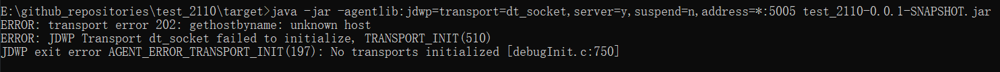

# Debug 技巧

> 以下内容基于的环境：Windows10、IntelliJ IDEA 2019.3
>
> 官方文档：[Debug code](https://www.jetbrains.com/help/idea/debugging-code.html)

## 按钮介绍


| 按钮                                                         | 名称                       | 说明                                                         | win快捷键        |
| ------------------------------------------------------------ | -------------------------- | ------------------------------------------------------------ | ---------------- |
|  | Show Execution Point       | 跳转到当前执行端点。                                         | Alt + F10        |
|  | Step Over                  | 步过，一行一行地往下走。如果这一行上有调用方法，执行时不会进入方法。 | F8               |
|  | Step Into                  | 步入，进入代码或者说进入到方法内部。                         | F7               |
|  | Force Step Into            | 强制步入，强制进入代码或者说进入到方法内部。能进入任何方法，查看底层源码的时候可以用这个进入官方类库的方法。 | Alt + Shift + F7 |
|  | Step Out                   | 步出，跳到下一个断点或者跳出方法。从步入的方法内退出到方法调用处，此时方法已执行完毕，只是还没有完成赋值。 | Shift + F8       |
|  | Drop Frame                 | 回退断点。回退到当前方法的调用处。                           |                  |
|  | Run to Cursor              | 运行到光标处。你可以将光标定位到你需要查看的那一行，然后使用这个功能，代码会运行至光标行，而不需要打断点。 | Alt + F9         |
|  | Evaluate Expression        | 表达式评估。可以改变变量的值，这样有时候就能很方便我们去调试各种值的情况了。 | Alt + F8         |
|  | Trace Current Stream Chain | 流式编程调试插件，对 Stream API 的调试。属于IDEA自带的插件。 |                  |
|                                                              |                            |                                                              |                  |
|  | Resume Program             | 恢复程序运行，直至下个断点或程序运行结束                     | F9               |
|  | View Breakpoints           | 查看断点，展示更多高级设置                                   |                  |
|  | Mute Breakpoints           | 置灰所有断点，再次点击，恢复                                 |                  |
|  | Get thread dunp            | 获得当前的线程堆栈                                           |                  |

---

其他 debug 快捷键

| win快捷键  | 说明                                                       |
| ---------- | ---------------------------------------------------------- |
| Shift + F7 | 智能步入。断点所在行上有多个方法调用，会弹出进入哪个方法。 |
| Ctrl + Shift + F8          | 指定断点进入条件                                           |


## 条件断点

点击`View Breakpoints`按钮可进行设置进入断点的条件，如下图所示


- **标注 1**：`View Breakpoints`，查看断点，展示更多高级设置
- **标注 2**：`Java Line Breakpoints`，展示项目中设置的所有断点
- **标注 3**：`Conditions`，设置条件断点（右键单击断点处也可进行设置）
- **标注 4**：`Remove once hit`，设置击中一次断点后，取消该断点
- **标注 5**：`Pass count `，设置当循环若干次后，进入断点，常用于循环语句


## 多线程调试

可对断点添加条件，如：`currentThread().getName().equals("线程2")` ，这样就能只挂起符合条件的线程

如下面所示，此条件确保调试器仅在当前线程的名称为 **线程2** 时才暂停当前线程


## 远程调试

> 官方文档：[Remote debug](https://www.jetbrains.com/help/idea/tutorial-remote-debug.html)

### 准备工作

- 明确远程服务器的 IP 地址。这里演示使用`localhost`
- 关掉服务器防火墙：`service iptables stop`。演示使用的是window环境，通过 控制面板->防火墙 关闭。

创建演示项目`test_2110`，编写一个返回String类型的get请求

1、使用idea进行创建后，在 `pom.xml` 中引入springboot有关依赖：

```xml
<dependency>
    <groupId>org.springframework.boot</groupId>
    <artifactId>spring-boot-starter</artifactId>
</dependency>
<dependency>
    <groupId>org.springframework.boot</groupId>
    <artifactId>spring-boot-starter-web</artifactId>
</dependency>
```

构建工具：

```xml
<build>
    <plugins>
        <plugin>
            <groupId>org.springframework.boot</groupId>
            <artifactId>spring-boot-maven-plugin</artifactId>
        </plugin>
    </plugins>
</build>
```

打包方式选择jar

```xml
<groupId>com.example</groupId>
<artifactId>test_2110</artifactId>
<version>0.0.1-SNAPSHOT</version>
<name>test_2110</name>
<description>练习IDEA远程debug功能</description>
<packaging>jar</packaging>
```

在 `application.yml` 中配置服务端口：

```yml
server:
  port: 8099
```

2、启动类

```java
import org.springframework.boot.SpringApplication;
import org.springframework.boot.autoconfigure.SpringBootApplication;

@SpringBootApplication
public class Application {
    public static void main(String[] args) {
        SpringApplication.run(Application.class, args);
    }
}
```

3、在Controller中编写一个get接口

```java
import org.springframework.web.bind.annotation.GetMapping;
import org.springframework.web.bind.annotation.RequestMapping;
import org.springframework.web.bind.annotation.RestController;

@RestController
@RequestMapping("/hello")
public class HelloController {
    @GetMapping("/getTitle")
    public String getStr(String str) {
        System.out.println("str = " + str);
        return "Hello, " + str;
    }
}
```

4、使用maven打包，在项目目录的 `target` 目录中生成 jar 包


### 本地配置

IDEA中设置远程调试，点击 `Edit Configurations` 进入 `Run/Debug Configuration` 界面


然后点击左上角的 `+` ，选择 `Remote` 后在右侧设置属性：


- **标注 1**：调试模式，默认为`Attach`
  - `Attach`：调试服务端（被调试远程运行的机器）启动一个端口等待我们（调试客户端）去连接
  - `Listen`：我们（调试客户端）去监听一个端口，当调试服务端准备好了，就会进行连接
  
- **标注 2**：传输方式，默认为`Socket`
  
  - `Socket`：macOS 及 Linux 系统使用此种传输方式
  - `Shared memory`： Windows 系统使用此种传输方式
  
- **标注 3**：服务器 IP 地址，默认为`localhost`，需要修改为目标服务器的真实 IP 地址

- **标注 4**：服务器端口号，默认为`5005`，需要修改为目标服务器的真实端口号

- **标注 5**：运行远程 JVM 的命令行参数

  - ```md
    -agentlib:jdwp=transport=dt_socket,server=y,suspend=n,address=5005
    ```

  - ```md
    -agentlib:jdwp=transport=dt_shmem,server=y,suspend=n,address=...
    ```


### 服务器配置

#### 1.对于 SpringBoot

由于笔者演示的服务器是本地的windows，而在上述参数中 **标注 2** 选择默认的 `Socket` 方式。这里就需要用 **Git Bath** 进行启动：

```shell
java -agentlib:jdwp=transport=dt_socket,server=y,suspend=n,address=5005 -jar test_2110-0.0.1-SNAPSHOT.jar
```

---

由于 **标注 2** 选择默认的 `Socket` 方式，在windows中如果使用黑窗口启动就会一直报错：`ERROR: transport error 202: gethostbyname: unknown host`




#### 2.对于 Tomcat

命令行参数，然后导入到 Tomcat 的配置文件（Linux路径：`tomcat/bin/catalina.sh`，Windows路径：`catalina.bat`）中。

在该配置文件的最上面，添加我们刚刚复制的那句话

- Linux：`export JAVA_OPTS='-Xdebug -Xrunjdwp:transport=dt_socket,server=y,suspend=n,address=5005'`

- Windows：`set JAVA_OPTS=-Xdebug -Xrunjdwp:transport=dt_socket,server=y,suspend=n,address=...`


### 开始调试

服务器启动好后，启动本地 Remote Server


如果连接成功，则会出现如下提示：


---

前提是本机得有项目的源码 ，在需要的地方打个断点，然后访问一个**远程的url**，断点就会停下来。

